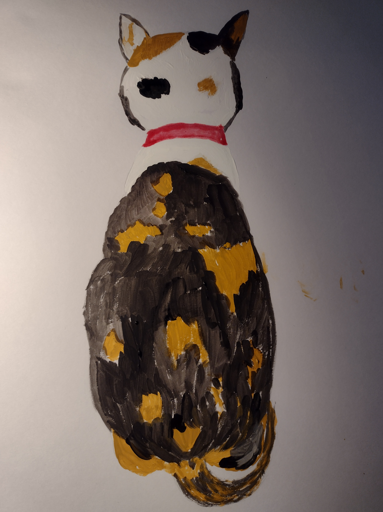

# 4. My first portrait (我的第一张画像)

The kind-hearted lady was always very busy. She seemed to have endless things to do. Sometimes, she played with me for a little while, but soon, she would get busy again.

She spent a lot of time rearranging furniture. It seemed like the position of the furniture changed every week, which was quite intriguing for me. For example, her desk started out in one corner of the room near the window, but later she moved it to the other side near the door because there was more space there. She even got a larger desk, and it took me a few seconds to walk from one end to the other. When she was working, I would sleep in one corner of the desk! There was a piano in the living room, initially placed opposite the desk, but now it's on the other side near the window. The kind-hearted lady had a lot of books, around eight or nine bookshelves in total, one in each room. The bookshelf in the living room started at the entrance to the kitchen, but now it's opposite the desk. Even my eating place changed a few times. For example, it initially was on one side of the kitchen's glass door, then moved to the other side, and eventually ended up on the opposite side of the glass door.

The kind-hearted lady had many beautiful paintings in her room. There were paintings of horses, landscapes, flowers, and cats. I saw different kinds of cats in these paintings, including white cats, black cats, blue cats, green cats, and red cats. They all looked cute, but none of them looked like me.

I wondered when I would have my own portrait?

When the kind-hearted lady took me out to play, she took many photos of me. When we were at home, she also took many pictures of me. I knew she spent a lot of time looking at my photos on her phone and computer. In truth, I didn't really need a portrait because I was always with the kind-hearted lady.

Recently, for a week, the kind-hearted lady didn't go to work, and she seemed very sad. She sat in front of her computer desk and cried continuously. I jumped onto her lap, and she held me close. I felt her body trembling. She wanted to say something to me but couldn't find the words. So, she just held me like that, silently shedding tears. I didn't know what had happened, but I sat in her arms, quietly comforting her.

After some time, the kind-hearted lady carried me to the windowsill, and she wanted me to look outside. I watched the outside scenery for a while and then looked at her. I saw her taking out watercolor paints and starting to paint.

I jumped onto the table to see what she was painting, and it was me! She had a picture of my back, which she had taken when I was facing the kitchen glass door. She started by sketching the outline of me with a pencil and then added colors to my body using watercolors. Even though I am a three-colored calico cat, my back and tail only have two colors, yellow and black. The kind-hearted lady painted my back first and then my head, ears, and my collar.

It was a simple watercolor painting because my face couldn't be seen. The kind-hearted lady told me it was her first time painting me, and she wasn't confident about painting my face. This was my first portrait, a painting of my back. But I loved it; this was how I looked every day when I gazed out into the world.

After finishing the painting, the kind-hearted lady's mood seemed to improve a lot. She took me out for a walk, still shaking the bells in her hand, and I followed behind her. She would occasionally turn around to check if I was still there and then smile at me. I could sense that she was trying hard to hide her sadness. She was deeply troubled, but she wanted to tell me that she wouldn't give up on me. Even though there was a hint of sadness in her eyes, there was also a strong sense of responsibility. She was a responsible person, and I was lucky to be entrusted to her home. It was fate that brought us together, and we would both cherish this connection.

好心人每天都很忙，她似乎有做不完的事，她有时候也和我玩一会儿，但就是一会儿的时间。很快她又开始忙起来了。

她花了很多时间安置家具，似乎每个星期家具的位置都要换一换，这对于我来说很是新奇。比如她的书桌开始的时候在房间里靠窗的一角，后来她把桌子移到靠门的一边，因为那里空间大一些，她换了一个更大一点的桌子，我从桌子一头走到另一头还要花几秒中的时间。在她工作的时候，我就在桌子的一角儿上睡觉！客厅里有一架钢琴，开始放在书桌的对面，现在在窗口的对面。好心人家里有好多书，书架就有八九个，每个房间都有。客厅里的书架呢，开始在通往厨房的玄关处，现在在书桌的对面。我吃饭的地方也变过几次，比如开始的时候在厨房玻璃门的一边，后来改到玻璃门的另一边，再后来改到了玻璃门的对面。

好心人房间里有好多漂亮的画，有赛马，有风景，有花，有猫。我看到好多不同样子的猫，我刚到这个家的时候就看见有白猫，黑猫，蓝猫，绿色的猫和红色的猫。 这些猫看上去都很可爱，不过他们都不是我的样子。

我在想什么时候，我也有一个画像呢？

好心人带我出去玩的时候，她给我拍了很多照片，在家里的时候，她也给我拍了很多照片。我知道她花很多时间看我的照片，我的照片在她的手机上，在她的电脑上。我其实也不需要一个画像，因为我已经无时无刻不在好心人身边了。

好心人最近有一个星期，她没有上班，她看上去很悲伤。她坐在她的电脑桌子前面，一直都在流泪。我跳上她的大腿，她抱着我，我感觉到她的身体在发抖。她想和我说却说不出来，她就那样抱着我，无声的流泪。我不知道发生了什么，我就坐在她的怀里，安静的听她流泪。

不知道过了多久，好心人抱我到窗台，让我看外面的风景。我看了一会儿外面的风景，然后看看她。我看到她把水彩颜料拿出来开始画画。

我跳到桌子上看她画的什么，她画的是我！她的电脑里放了一张我的背影的照片，那是我面对着厨房玻璃门的时候她给我拍的。她先用铅笔画了我的轮廓，然后用水彩为我的身体加颜色。尽管我是三色印花猫，我的背部和尾巴只有两个颜色，黄色和黑色。好心人先画我的背部，然后画我头部，我的耳朵，还有我的项圈。

这是一张简单的水彩画，因为看不到我的脸。好心人对我说，她这是她第一次画我，她还没有把握画我的脸，这是我的第一个画像，是一张背影。不过我很喜欢，这就是我每天望着外面的世界的样子。

画过画后，好心人的心情好像好了很多，她带我出去散步。她依旧摇着手里的铃铛，我跟在她的后面，她偶尔回头，看看我是不是还在，然后对我笑笑。我似乎看得出她努力隐藏着自己的悲伤，她心里很难过，但是她想告诉我，她不会放弃我的，她的目光虽然黯淡，但是那里有坚定的责任感，她是一个有责任心的人，我很幸运的被托付在她的家里，这是我和她的缘分，我们都会好好珍惜这份缘分的。